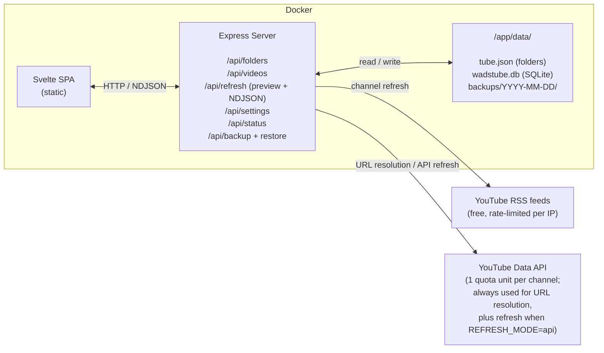

# WadsTube


A self-hosted YouTube subscription manager and video feed viewer. Organizes your
YouTube subscriptions into folders, pulls new videos via channel RSS feeds (or
the YouTube Data API — your choice), stores them in SQLite, and presents them in
a clean, themed web interface. Runs in Docker.

## What's new in v2.1

- Refresh now opens a read-only preview showing the exact folder scope, due and
  skipped counts/reasons, effective mode, and quota required before any network
  work starts. Confirmation recomputes the same shared plan server-side.
- Smart refresh rules are editable from **Operations > Refresh rules**, persist
  in SQLite, and can be reset to the environment-configured defaults.
- Returning channels have a scoped **Returns** inbox. Acknowledgement removes
  the active badge without erasing its stored highlight history, and large
  inboxes are acknowledged in explicit batches.
- Channel Health supports bounded bulk refresh, favorite/unfavorite, delete,
  and direct-membership move actions for up to 500 selected channels.
- **Operations** now includes Pacific-day quota history, a seven-complete-day
  average, a current eligibility/full-pass snapshot, system status, an explicit
  database integrity check, and on-demand nightly-backup verification.
- API refreshes automatically use RSS when the daily quota cannot cover the
  selected channels.
- The first structured quota or rate-limit response during a refresh trips a
  shared breaker, retries affected channels through RSS, and routes the rest of
  that refresh through RSS.
- RSS fallback stays within a dedicated five-channel concurrency limit and does
  not hide authentication, permission, not-found, or availability errors.
- Refresh reports distinguish API units, RSS network attempts, and the number of
  channels redirected to RSS.

## Why

YouTube's native subscription feed is a single unsorted stream. PocketTube
(browser extension) adds folder organization but only works in the browser.
WadsTube gives you a standalone app with full control: folder management,
user-initiated per-folder refresh, search, drag-and-drop channel adding, and no
shorts.

## Features

- **Folder-organized feed** — sidebar with expandable folder/subfolder hierarchy
- **Expandable channels in sidebar** — click the chevron next to a folder to see
  channels inline; click a channel to filter videos to just that channel
- **Channel management** — manage channels from each folder, rename/remove them
  from the sidebar, and mark favorite channels with a star. A rename sticks
  across later refreshes.
- **Legacy subscription quarantine** — old URL-style subscription IDs remain in
  their original folders as visible “Needs resolution” entries; they can be
  renamed, moved, removed, or resolved in place but never enter refresh, quota,
  unread, or database-health paths until resolution succeeds.
- **Reader state** — mark videos watched/unread, star them, or hide/restore
  them. State is stored in SQLite and shared across devices.
- **Reader views** — all, unread, starred, and hidden views; favorite-channel
  filtering; newest/oldest/favorites-first/returns-first sorting; grid, compact,
  and list layouts.
- **Persistent navigation** — folder, channel, search, reader view, favorites,
  sort, and density are encoded in the URL for reloads and browser back/forward.
- **Refresh preview** — inspect the selected folder scope, channels due now,
  skipped reasons, effective RSS/API mode, and quota arithmetic before
  confirming a refresh.
- **Refresh health and bulk operations** — search/filter health rows and refresh,
  favorite, unfavorite, delete, or move up to 500 selected channels in one
  bounded action.
- **Manual-only refresh** — WadsTube makes no automatic channel requests; every
  refresh starts from a user click
- **RSS or API refresh** — RSS is free; user-initiated refreshes can instead use
  the YouTube Data API when RSS is rate-limited
- **Smart refresh selection** — a user-initiated folder/all refresh waits 2
  hours after a refresh that found a new upload, and skips inactive channels
  until their configured minimum has elapsed (6 h after 90 days, 24 h after 365
  days by default)
- **Returns inbox and history** — a new long-form upload from a channel
  returning after at least 3 months is highlighted without marking an initial
  backfill. The exact current view can be acknowledged, while the historical
  reason remains stored.
- **Quota ledger** — persistent Pacific-day API usage, remaining general/search
  budgets, 1–90 day history, a seven-complete-day average, a snapshot-only
  current/full-pass estimate, per-endpoint counts, and per-refresh
  API/RSS/Shorts reports
- **Operations dashboard** — inspect cheap system health, database/WAL size,
  process/refresh/backup state, subscription counts, and run an explicit
  rate-limited SQLite integrity check when needed
- **Live progress UI** — a per-channel overlay shows each channel as it's
  fetched, with a `done/total` counter, running "new videos" tally, and error
  count
- **No YouTube Shorts** — shorts are automatically detected (via a free HEAD
  request) and filtered out; transient classification failures remain `unknown`
  and are retried on later refreshes
- **Search** — filter videos by title, channel name, or description
- **Drag-and-drop** — drag any YouTube URL (video, channel, @handle, shorts,
  live) onto a folder to add that channel
- **Paste to add** — paste URLs in the channel list panel (works on mobile)
- **URL resolution** — video URLs are auto-resolved to the channel via YouTube
  API (1 unit)
- **Verified exports and backups** — subscription JSON export/import is
  separate from a downloadable full export containing `tube.json`, an
  integrity-checked SQLite snapshot, checksums, and a manifest. Nightly
  snapshots are structurally verified before publication and can be verified
  again on demand.
- **Accessible video actions** — native YouTube links plus explicit copy,
  watched, star, and hide controls
- **Mobile-friendly** — long-press for context menus, iOS home screen icon,
  responsive layout
- **System light/dark mode** — auto-switches with OS theme
- **Local timezone** — video publish times displayed in your browser's timezone
- **PocketTube migration** — auto-imports from PocketTube JSON export on first
  run

## Architecture



### Stack

- **Backend:** Node.js + Express
- **Frontend:** Svelte (built with Vite)
- **Deployment:** Docker (multi-stage build, Alpine Linux)
- **Data:** `tube.json` (folders/channels, atomic writes) + `wadstube.db`
  (SQLite, WAL mode) on a mounted volume

### Data Flow

1. **Page load** — frontend fetches `/api/folders` (folder tree) and shows the
   sidebar. No videos are loaded until you click a folder.
2. **Select folder** — frontend fetches `/api/videos?folder=X`, which reads from
   `wadstube.db` (no network call).
3. **Preview** — clicking Refresh GETs `/api/refresh/preview/:folder` (or the
   all-library preview). The shared planner reports the exact frozen scope,
   membership/due/skipped counts, reasons, effective mode, quota snapshot, and
   full-pass arithmetic without reserving quota or fetching YouTube.
4. **Refresh** — confirmation POSTs to `/api/refresh/:folder`; the server takes
   the refresh lock, recomputes eligibility with the same planner, and streams
   NDJSON events back (init, start/done per channel, final summary). Each
   channel is fetched via RSS or the YouTube Data API depending on
   `REFRESH_MODE_MANUAL`. If API quota cannot cover the selected due set, the
   run uses RSS; authoritative quota/rate-limit errors during an API run also
   trip an RSS fallback breaker. New videos are inserted, existing ones have
   title/description/thumbnail refreshed, and each channel keeps the last
   `MAX_VIDEOS` visible entries plus a bounded Shorts cache.
5. **Smart selection** — the manual folder/all request checks stored
   refresh/upload timestamps and whether the previous successful refresh
   discovered a new upload. It applies the active persisted policy, or the
   environment defaults when none is persisted. A direct per-channel retry is
   an explicit override.
6. **Add or resolve channel** — frontend POSTs a URL to
   `/api/folders/:id/channels`, or resolves a quarantined legacy row through its
   in-place resolver. Canonical `UC...` IDs are free; handles/video URLs use the
   normal quota-accounted YouTube resolution path. The server
   resolves the URL to a channel ID (via YouTube Data API if needed), adds it to
   `tube.json`. Name-based identifiers remain accepted for older clients.

### Data Storage

Two files in `data/`:

**`tube.json`** — your subscription data (folders + channels, atomic write):

```json
{
  "version": 1,
  "folders": [
    {
      "id": "cooking",
      "name": "Cooking",
      "channels": [
        { "id": "UCxAS...", "name": "America's Test Kitchen", "addedAt": "2026-04-15T..." },
        { "id": "UCzZN...", "name": "My Favorite Chef", "addedAt": "...", "userRenamed": true },
        { "id": "https://www.youtube.com/c/legacy", "name": "Legacy reference", "addedAt": "2020-01-01T...", "unresolved": true }
      ],
      "children": [
        { "id": "baking", "name": "Baking", "channels": [...], "children": [] }
      ]
    }
  ]
}
```

`userRenamed: true` is set automatically when you rename a channel from the
sidebar so later refreshes leave your chosen name alone. Folder IDs are stable
identifiers and do not change on rename; older slug IDs remain valid. The tree
is normalized on every load and on restore — missing `channels`/`children`
arrays are coerced to `[]`, folder nesting is capped at five levels (depth 0–4),
and prototype-pollution keys are stripped. Resolved channel IDs must match
`^UC[A-Za-z0-9_-]{22}$`; a nonempty legacy reference that does not match is
preserved with `unresolved: true` and excluded from all network and SQLite
channel paths. Empty or structurally malformed channel entries remain validation
losses. Startup repairs are persisted after saving the original as
`tube.json.pre-normalize.*`; restores are rejected with detailed validation
errors if normalization would drop folders or channels.

**`wadstube.db`** — SQLite, WAL mode. Core tables include:

- `channels(...)` — last-known title, RSS conditional-request hints, favorite
  flag, separate attempt/success timestamps, newest known upload, and failure
  state
- `videos(...)` — cached video metadata, retryable Shorts classification, and
  durable pending/final return-highlight reason
- `video_state(video_id PK, watched_at, starred_at, hidden_at,
  highlight_acknowledged_at, updated_at)` — durable reader state and active
  return acknowledgement; `videos.highlight_reason` retains highlight history
- `api_usage(...)` and `refresh_runs(...)` — Pacific-day quota ledger and a
  bounded history of persistent run reports, including requested/effective mode
  and RSS-fallback count/reason
- `app_settings(key PK, value_json, updated_at)` — persisted validated settings,
  currently the smart-refresh policy
- `videos_fts` — FTS5 search index, transactionally rebuilt on startup; search
  falls back to `LIKE` if FTS5 is unavailable

The schema upgrades additively through SQLite `user_version` 11. The newest
migrations add `app_settings`, `video_state.highlight_acknowledged_at`, its
index, and cleanup of reader-state rows whose videos no longer exist. Existing
reader, video, channel, refresh, and quota history is preserved.

If `cache.json` exists on first boot (from a pre-RSS install), it's imported
into the DB once and renamed `cache.json.migrated`.

## How the Code Works

### Server

#### `server/index.js` — Entry Point

Loads `tube.json` (or auto-migrates from PocketTube format), opens the SQLite
DB, runs the one-time cache.json migration if needed, and creates the shared
`appState` used by every route handler. Mounts API routes, schedules nightly
backups, and serves the built Svelte SPA. Channel network requests only run from
user-initiated routes.

#### `server/lib/data.js` — Data Layer

Manages `tube.json`. Load/save with atomic writes, folder/channel CRUD,
recursive channel-id collection, name syncing (propagates channel titles from
the DB into `tube.json`).

#### `server/lib/db.js` — SQLite Wrapper

`better-sqlite3` in WAL mode. Sequential `user_version` migrations upgrade
existing databases without dropping data. The wrapper stores smart-refresh
timestamps, reader state, quota usage and refresh runs; uses FTS5 for indexed
video search with a safe `LIKE` fallback; and uses `VACUUM INTO` for consistent
snapshots.

#### `server/lib/frontend.js` — Frontend Serving

Serves `index.html` with `Cache-Control: no-store`, hashed bundles with
immutable one-year caching, and a real `404` for missing `/assets/*` paths so an
open tab cannot receive SPA HTML for a stale JavaScript bundle after deployment.

#### `server/lib/rss.js` — Atom Feed Client

Fetches `https://www.youtube.com/feeds/videos.xml?channel_id=UC...`, parses with
`fast-xml-parser`. Sends `If-None-Match` / `If-Modified-Since` when the DB has
them (YouTube doesn't currently emit these, but the code is ready if they turn
it on). Retries once with 1s backoff and once more with 3s backoff on 404/5xx,
which YouTube throws under per-IP rate pressure.

#### `server/lib/youtube.js` — YouTube Data API Client

- `resolveUrl(apiKey, url)` — parses YouTube URLs in every format (video,
  channel, @handle, shorts, live, youtu.be) and resolves to
  `{ channelId, channelTitle }`. Canonical channel URLs are free (0 units).
  Video URLs use `videos.list` (1 unit). `@handle` URLs use exact
  `channels.list(forHandle=...)` resolution (1 general quota unit, without
  consuming the separate search-call allowance).
- `fetchChannelViaApi(apiKey, channelId)` — `playlistItems.list` for the
  channel's uploads playlist (1 unit, up to 50 items). Returns the same shape as
  the RSS client so `refresh.js` can dispatch on mode.
- `checkIsShort(videoId)` — HEAD request to `/shorts/{id}`; returns `short`,
  `long`, or retryable `unknown`.

#### `server/lib/refresh.js` — Refresh Orchestrator

`refreshChannels(db, ids, opts, onEvent)` spins up per-channel workers in a
`p-limit` pool (5 concurrent in RSS mode, 20 in API mode). API quota/rate-limit
responses are recognized only by their exact structured error code; they trip a
run-wide breaker and redirect the failed and not-yet-started channels through a
dedicated five-request RSS pool. Authentication, permission, not-found, and
availability errors are not masked. Every attempt stores
`last_refresh_attempt_at`; only a successful response (`ok` or RSS `304`)
advances `last_refreshed_at`, and a feed response advances `latest_upload_at`.
Worker failures are isolated and all workers settle before the run finishes or
releases its lock. New long-form videos get the strongest matching
inactivity-rule ID when the channel had been refreshed before. Unknown Shorts
are selected from SQLite and retried with paced backoff even after they fall
outside the current RSS window; a pending return badge survives until
classification succeeds. Every run persists its API/RSS/Shorts report.

#### `server/lib/refresh-plan.js` — Shared Refresh Planner

Builds the read-only preview and the execution plan used after POST takes the
lock. It deduplicates resolved memberships, excludes unresolved entries,
evaluates the active smart policy, groups due/skipped reasons, preflights API
capacity, and reports current full-pass arithmetic. The preview never reserves
quota; execution always recomputes instead of trusting stale client data.

#### `server/lib/settings.js` — Persisted Settings

Loads the validated smart-refresh policy from `app_settings`. A valid persisted
policy takes precedence over `SMART_REFRESH_POLICY_JSON`; when no persisted
value exists, or a stored value is invalid at startup, the environment-derived
default is used. Reset deletes the persisted override rather than copying a
second default into SQLite.

#### `server/lib/backup.js` — Nightly Backups

Owns the global refresh lock while staging `tube.json` and a
`VACUUM INTO wadstube.db` snapshot for `data/backups/YYYY-MM-DD/` every night at
1 am local time (container `TZ`). Before publication, staged `tube.json` must
parse as normalization-compatible version 1 data and staged SQLite must pass a
read-only `quick_check`. The complete verified pair is published as one
directory swap, so a failed snapshot, verification, or publication preserves
the prior pair. Retention ignores incomplete staging/directories.
Grandfather-Father-Son retention keeps 4 daily + 4 weekly + 4 monthly snapshots
and catches up on boot when overdue. The controller exposes its next run,
running state, and last success/failure to system status.

#### `server/lib/migrate.js` — PocketTube Migration

One-time migration from PocketTube's JSON export to the native `tube.json`
format.

#### `server/lib/migrate-cache.js` — cache.json → SQLite

One-time import of a legacy `cache.json` into SQLite on first boot with the new
codebase. Renames the file afterwards so it doesn't re-run.

#### `server/routes/folders.js` — Folder & Channel API

- `GET /api/folders` — folder tree summary (names + counts)
- `POST /api/folders` — create folder (validates name: no `../`, `/`, `\`, null
  bytes, max 100 chars)
- `PATCH /api/folders/:id` — rename
- `DELETE /api/folders/:id` — delete
- `GET /api/folders/:id/channels` — favorites first, then alphabetical
- `POST /api/folders/:id/channels` — add channel by ID or URL (auto-resolves)
- `POST /api/folders/:id/channels/:legacyId/resolve` — quota-accounted,
  collision-safe in-place replacement of one unresolved membership
- `DELETE /api/folders/:id/channels/:channelId` — remove
- `PATCH /api/folders/:id/channels/:channelId` — rename
- `POST /api/folders/:id/channels/:channelId/move` — move to another folder

Routes resolve immutable IDs first. An exact, unique legacy folder name remains
supported for older clients and returns `Deprecation: true` plus an HTTP
`Warning` header; ambiguous names are rejected.

#### `server/routes/videos.js` — Video API

- `GET /api/videos?folder=ID&view=unread&favorites=1&sort=newest` — filtered
  DB-cached videos
- `GET /api/videos/counts` — unread counts by channel
- `GET /api/videos/returns?...&limit=1..5000` — exact scoped count plus an
  explicit bounded list of unacknowledged return IDs
- `POST /api/videos/returns/acknowledge` — acknowledge 1–5,000 explicit unique
  video IDs; large UI actions repeat bounded batches against a frozen scope
- `PATCH /api/videos/:videoId/state` — update watched, starred, or hidden state

#### `server/routes/channels.js` — Channel Preference & Health API

- `GET /api/channels?status=error|stale` — refresh-health rows
- `PATCH /api/channels/:channelId` — update the favorite flag
- `DELETE /api/channels/:channelId` — remove a channel from every folder and
  purge its cached data
- `POST /api/channels/:channelId/refresh` — retry one subscribed channel
- `POST /api/channels/bulk/refresh` — refresh 1–500 explicit subscribed IDs
- `PATCH /api/channels/bulk/favorite` — favorite/unfavorite 1–500 IDs
- `DELETE /api/channels/bulk` — globally remove 1–500 IDs and their cached
  video/refresh/reader state, with subscription-file rollback on DB failure
- `POST /api/channels/bulk/move` — move only each selected channel's direct
  source-folder membership to one explicit destination

Bulk move does not move descendant-folder or other-folder memberships. If the
destination already contains a selected channel, the direct source membership
is removed and the two destination records are deterministically merged rather
than duplicated. The earliest `addedAt` is kept; a source user-renamed label
wins only when the destination label was not user-renamed.

#### `server/routes/refresh.js` — Refresh API (streaming NDJSON)

- `GET /api/refresh/preview` — read-only all-library plan
- `GET /api/refresh/preview/:folder` — read-only exact-folder plan
- `POST /api/refresh` — refresh every channel referenced by any folder
- `POST /api/refresh/:folder` — refresh only channels in that folder

Both stream NDJSON events (Content-Type `application/x-ndjson`) with one event
per line:

```json
{"type":"init","total":42}
{"type":"start","channelId":"UC...","channelTitle":"Tom Scott"}
{"type":"done","channelId":"UC...","channelTitle":"Tom Scott","status":"ok","newVideos":2}
...
{"type":"summary","refreshed":40,"new_videos":57,"errors":2,"requested_mode":"api","effective_mode":"api+rss","rss_fallbacks":3,"fallback_reason":"quotaExceeded","api_units":20,"rss_requests":3,"total_channels":...,"total_videos":...}
```

If another manual refresh, restore, or backup already owns the lock, the route
returns 409 immediately so the client can surface the conflict rather than
stall.

#### `server/routes/settings.js` — Smart Refresh Settings API

- `GET /api/settings/smart-refresh` — active policy, source, and environment
  default
- `PUT /api/settings/smart-refresh` — validate and persist the policy override
- `DELETE /api/settings/smart-refresh` — delete the override and reactivate the
  environment default

#### `server/routes/status.js` — Operations and Observability API

- `GET /api/status/quota/history?days=1..90` — Pacific-day bucket/endpoint
  history, including zero-use days and current status
- `GET /api/status/quota/forecast` — seven complete-day average plus current
  eligibility and full-pass quota arithmetic; `timeProjection` is deliberately
  `null`
- `GET /api/status/system` — cheap version/process, lock/task, mode/policy,
  database count/size/WAL, subscription, and backup-controller status; it does
  not run an integrity scan
- `POST /api/status/system/database-check` — explicit rate-limited live SQLite
  `quick_check`
- `GET /api/status/backups?limit=1..100` — bounded complete-pair listing
- `POST /api/status/backups/:YYYY-MM-DD/verify` — strict dated, read-only JSON
  normalization and SQLite `quick_check` verification; it never restores data

### Client

#### `client/src/stores/feed.js` — State Management

Svelte writable stores cover folders/videos, the active folder/channel, reader
view, favorites, sort, density, health, operations, refresh progress, errors and
toasts. A
shared `channelLists` cache keeps favorite/unread metadata consistent across
duplicate folder memberships and the channel modal. URL state is synchronized
with browser navigation. `refreshFolder()` incrementally reads NDJSON into
`refreshProgress` and returns the final summary.

#### `client/src/App.svelte` — Root Component

Mounts Header, Sidebar, VideoGrid, shared modal surfaces, Toast, and
RefreshProgress. Loads folders on mount.

#### `client/src/lib/Header.svelte` — Top Bar

Hamburger toggle, title, search with clear, gear menu (operations,
backup/restore), and a refresh-preview button. The completion toast reports new
videos, errors/skips,
channels checked, API units used by that refresh, API units used for the current
Pacific quota day, and the RSS-fallback channel count when nonzero.

#### `client/src/lib/Sidebar.svelte` — Folder & Channel Navigation

Recursive folder tree keyed by immutable folder IDs, expandable channels,
deduplicated unread counts, favorite toggles, keyboard/touch action menus for
folder rename/delete and channel rename/move/remove, drag/drop URL targets, "+
New Folder", and mobile overlay.

#### `client/src/lib/VideoGrid.svelte` — Video Display

Server-filtered reader view with all/unread/starred/hidden and favorite-channel
controls, an exact scoped Returns inbox, newest/oldest/favorite/return ordering,
infinite scroll, and grid/compact/list density. **Returns first** promotes
red-bordered return uploads and keeps each group newest-first. “Acknowledge all”
freezes the current folder/channel/search/favorite/sort scope and processes
explicit IDs in server-bounded batches until complete or a reported partial
failure.

#### `client/src/lib/VideoCard.svelte` — Single Video

Native video and channel links, thumbnail/title/description/date,
watched/starred/hidden/copy actions, favorite-channel marker, a return badge when
`highlight_reason` is active, and per-video acknowledgement.

#### `client/src/lib/FolderChannels.svelte` — Channel Management Modal

Favorite-first channel list with paste bar, drag-drop, favorite toggle, and
remove button. Quarantined legacy entries expose one in-place resolver; the
original row stays intact if resolution, save, or database update fails. The
modal traps focus, closes on Escape, and restores focus to its opener.

#### `client/src/lib/RefreshPreview.svelte` — Refresh Confirmation

Freezes the selected folder scope, loads the read-only plan, explains due and
skipped reasons plus RSS/API/quota effects, and performs the POST only after
confirmation. Eligibility is recomputed server-side.

#### `client/src/lib/ChannelHealth.svelte` — Bounded Bulk Operations

Searches, filters, and sorts channel health; reports selection hidden by
filters; caps selection at 500; freezes action IDs while busy; and exposes bulk
refresh, favorite/unfavorite, global delete, and direct-membership move.

#### `client/src/lib/OperationsPanel.svelte` — Operations Dashboard

Keyboard-accessible tabs edit/reset refresh rules, visualize quota history and
snapshot arithmetic, show cheap system/backup state, launch the explicit
database check, and verify listed nightly backups on demand.

#### `client/src/lib/ModalShell.svelte` — Shared Modal Behavior

Provides one focus trap, effective hidden/inert filtering, Escape/backdrop
close, ARIA title/description wiring, and opener focus restoration for every
modal surface.

#### `client/src/lib/RefreshProgress.svelte` — Live Refresh Overlay

Bottom-right panel shown while a refresh is active. `done / total` counter,
running `+N new` tally, `N errored` suffix when applicable, and one line per
currently-fetching channel. Shows up to `CHANNEL_CONCURRENCY_*` lanes (5 for
RSS, 20 for API).

#### `client/src/lib/Toast.svelte` — Notifications

Fixed-position toast at bottom-center, 3-second auto-dismiss. Success (green),
error (red), info (neutral).

### Docker

**Dockerfile** — multi-stage build:

1. Stage 1 (`client-build`): installs Svelte deps, runs `vite build`, emits
   `client/dist/`.
2. Stage 2 (runtime): Alpine Node 22; temporarily installs `python3 make g++` so
   `better-sqlite3` can compile for musl, then removes them. Includes `wget` and
   `tzdata`; `TZ=America/Los_Angeles` is baked in so the nightly backup
   scheduler fires at 1 am Pacific regardless of host timezone.

**docker-compose.yml**: mounts `./data` to `/app/data`, passes env vars, 512 MB
memory limit, health check every 30 s, `restart: unless-stopped`.

**.dockerignore**: excludes `node_modules`, `client/dist`, `.git`, `.env`,
`data/` — necessary so host-built native modules (glibc) don't clobber the
image's musl build of `better-sqlite3`.

## Setup

### 1. Get a YouTube Data API Key (optional for RSS-only use)

1. [Google Cloud Console](https://console.cloud.google.com) → new project
2. **APIs & Services > Library** → **YouTube Data API v3** → **Enable**
3. **APIs & Services > Credentials** → **Create Credentials > API key**
4. Copy the key

The key is used for `@handle` and video URL resolution. Canonical
`/channel/UC...` URLs and RSS refresh work without one. Any refresh mode set to
`api` requires the key.

### 2. Configure

Create a `.env` file in the project root:

```env
YOUTUBE_API_KEY=your_api_key_here
```

See [Environment Variables](#environment-variables) for tunable knobs.

### 3. Add Your Subscriptions

#### Option A: Import from PocketTube

Export your PocketTube subscriptions (the browser extension provides a JSON
export). Drop it in `data/`:

```text
data/youtube_subscription_manager_*.json
```

On first startup, WadsTube auto-migrates this to `tube.json`.

#### Option B: Start fresh

Create `data/tube.json`:

```json
{ "version": 1, "folders": [] }
```

Then add folders and channels through the web UI.

### 4. Deploy with Docker

```bash
docker compose up --build -d
```

The app runs at `http://localhost:3000`.

## Usage

### Viewing Videos

1. Open the app — you'll see the folder sidebar (hamburger menu on mobile).
2. Click a folder to load its videos (no network call — read from SQLite).
3. Click "All" for every folder's videos.
4. Use search to filter by title, channel, or description.

### Refreshing

- Click **Refresh** to preview the current folder (or All). Review how many
  unique channels are due or skipped, why they are due/skipped, the requested
  and effective mode, required/remaining quota, and current full-pass capacity.
- Click **Refresh N due** to begin. Opening or cancelling the preview makes no
  YouTube request and spends no quota. Confirmation captures the selected
  folder scope, then the server recomputes a fresh eligibility plan after
  taking the lock.
- A live panel in the bottom-right shows each channel being fetched, a
  done/total counter, and a running "+N new" tally.
- When it finishes, a toast summarizes the result (`Added 42 new videos`, or
  `No new videos (3 channels errored)`).
- No channel refresh runs in the background. Closing the app or leaving it idle
  makes no YouTube channel requests.

### Returns Inbox

- Choose **Returns** from the View menu to show the exact current
  folder/channel/search/favorite scope's unacknowledged return uploads.
- Acknowledge one card to remove its active badge, or choose **Acknowledge all**
  to confirm the exact scope. Large inboxes are processed in explicit batches
  of at most 5,000 video IDs, with progress and any remaining count reported.
- Acknowledgement does not delete the video or its historical
  `highlight_reason`; it records `highlight_acknowledged_at` and removes the
  active Returns treatment from normal reads.

### Channel Health and Bulk Actions

Open **Channel health** from the gear menu or sidebar. Search/filter by status,
due state, and upload inactivity, then select up to 500 channels. Selection
hidden by a changed filter is reported and can be cleared explicitly.

- **Refresh** runs one bounded manual refresh with the same quota/RSS fallback
  behavior as other manual refreshes.
- **Favorite/Unfavorite** updates every selected channel.
- **Delete** confirms the selected channel and membership counts, removes every
  membership for those channels, and purges their cached state.
- **Move** requires an exact direct source folder and destination. Only selected
  direct memberships in that source move; nested and other-folder memberships
  remain. Existing destination memberships are merged rather than duplicated.

### Managing Folders

- **Create:** "+ New Folder" at the bottom of the sidebar.
- **Rename/Delete:** open the folder's `•••` action menu.
- **View Channels:** choose **Manage channels** from that action menu.

Deleting a folder or channel also purges the corresponding rows from
`wadstube.db` so stale subscriptions don't keep appearing in the feed.

### Viewing & Filtering by Channel

- Click the chevron next to a folder to expand channels inline.
- Click a channel to filter videos to just that channel (click again to
  deselect).
- Open a channel's `⋮` action menu for rename, move, or remove; the native menu
  controls work with keyboard and touch.
- Use the star next to a channel to add or remove it from Favorites.

### Adding Channels

- **Drag-and-drop** a YouTube URL onto a folder.
- **Paste** a URL in the channel list modal.
- Accepted: `youtube.com/watch?v=...`, `youtube.com/channel/UC...`,
  `youtube.com/@handle`, `youtu.be/...`, `youtube.com/shorts/...`,
  `youtube.com/live/...`.
- A **Needs resolution** legacy row can be replaced in place from the folder's
  channel manager. A canonical `UC...` ID costs no quota; URL/handle/video
  resolution uses the same quota ledger as normal channel addition. The
  original membership remains if any step fails.

### Operations Dashboard

Open **Operations & refresh rules** from the gear menu:

- **Refresh rules** edits the post-upload cooldown, no-history interval,
  failure retry delays, and extensible inactivity rules. Save persists the
  validated override in SQLite. **Reset defaults** deletes that override and
  immediately reactivates `SMART_REFRESH_POLICY_JSON` (or built-in defaults).
- **Quota** shows 7/14/30/90 Pacific-day history, the current general/search
  balance, a seven-complete-day average, and current due/full-pass arithmetic.
  This is a snapshot, not a prediction of when channels will upload or refresh.
- **System** shows process uptime, refresh lock/tasks, active mode/policy source,
  database counts/size/WAL, subscription counts, and backup-controller state.
  The cheap status read does not scan the database; **Run database integrity
  check** explicitly starts the rate-limited `quick_check`.
- **Backups** lists complete nightly pairs and verifies a selected snapshot's
  normalized JSON plus read-only SQLite `quick_check`. Verification never
  restores or changes live data.

### Backup & Restore

**From the UI:** **Export subscriptions** downloads `tube.json` data and
**Import subscriptions** validates and imports that JSON. Import waits for
refresh to become idle and snapshots both live files before changing or purging
data. **Full backup** streams a bounded-memory POSIX TAR containing
`manifest.json`, `tube.json`, and a consistent SQLite snapshot. The manifest
records byte counts, SHA-256 checksums, and SQLite `quick_check` proof.
Full-bundle restore is intentionally a controlled offline operation; the web app
never replaces the live database from an uploaded binary bundle.

Verify a downloaded full backup without extracting it:

```bash
cd server
npm run verify-backup -- /path/to/wadstube-full-....tar
```

For a controlled full restore, verify and extract to a new empty directory, stop
WadsTube, preserve the current data directory, then copy the two verified files
into place:

```bash
cd server
npm run verify-backup -- /path/to/backup.tar --extract /tmp/wadstube-verified
cd ..
docker compose stop
cp -a data "data.pre-full-restore-$(date +%Y%m%d-%H%M%S)"
cp /tmp/wadstube-verified/tube.json data/tube.json
cp /tmp/wadstube-verified/wadstube.db data/wadstube.db
docker compose up -d
```

**Nightly backups:** `data/backups/YYYY-MM-DD/` gets an atomically published
pair of `tube.json` + a consistent `wadstube.db` snapshot (via `VACUUM INTO`)
every night at 1 am local time. Before publication, `tube.json` is parsed and
checked for normalization losses, and SQLite is opened read-only for
`quick_check`. A failed stage preserves the previous same-day backup. The
scheduler catches up on startup if overdue. GFS retention considers only
complete pairs (4 daily + 4 weekly + 4 monthly). The Operations dashboard lists
up to 30 by default and can explicitly reverify any dated pair.

To restore a nightly backup:

```bash
cd data
cp backups/2026-04-10/tube.json .
cp backups/2026-04-10/wadstube.db .
docker compose restart
```

## Refresh Modes & Quota

User-initiated refreshes support two modes:

| Mode  | Cost                           | Rate limit                                         | Notes                                                                                        |
| ----- | ------------------------------ | -------------------------------------------------- | -------------------------------------------------------------------------------------------- |
| `rss` | free                           | YouTube throttles per-IP; can 404/5xx under bursts | 15-entry feeds; no `publishedAfter`; refresh pulls full feed every time, dedup by `video_id` |
| `api` | 1 unit per channel per refresh | none that you'll hit organically                   | 50 items per call; 1 unit regardless of `maxResults`                                         |

Some channel-add URL formats use the Data API:

| Action                                         | Cost                                                        |
| ---------------------------------------------- | ----------------------------------------------------------- |
| Add channel via channel URL (`/channel/UC...`) | 0 units                                                     |
| Add channel via video URL (`/watch?v=...`)     | 1 unit                                                      |
| Add channel via @handle (`/@name`)             | 1 general quota unit (`channels.list(forHandle=...)`)       |
| Shorts classification                          | 0 units (free HEAD request; transient failures are retried) |

Under YouTube's June 2026 quota model, a project receives 10,000 general quota
units per day, resetting at midnight Pacific. `search.list` also has a separate
default limit of 100 calls/day; WadsTube does not use it. At 1,300 channels:

- **`rss`** everywhere: 0 quota used for refresh.
- **`api`** for refresh: ~1,300 units per full pass → at most 7 full passes/day;
  6 passes (every 4 hours) use ~7,800 units and leave a practical safety margin.

The default is RSS so clicks consume no API quota. Set `REFRESH_MODE_MANUAL=api`
for predictable API-backed manual refreshes.

WadsTube reserves quota immediately before every actual Data API request,
including requests that return errors. General and `search.list` buckets are
stored separately using the Pacific quota day. A full API refresh uses a
conservative preflight snapshot; when the remaining general budget cannot cover
every selected due channel, the whole run switches to free RSS instead of
returning 429 or starting a partial API pass. Per-call reservation is still
authoritative: concurrent URL resolutions or other API work can consume that
snapshot, so an exact structured quota/rate-limit response during a run trips a
shared breaker and the failed plus later channels use RSS. Authentication,
forbidden, not-found, and availability errors remain visible errors. The header
and Channel Health panel show what remains, and every refresh report records
endpoint calls/units, RSS requests, Shorts probes, the run status/error,
remaining daily general budget, `requested_mode`, `effective_mode`,
`rss_fallbacks`, and `fallback_reason`. `rss_fallbacks` is a channel count;
`rss_requests` is a network-attempt count and can be larger when RSS retries
occur.

Operations quota history is read directly from `api_usage` for 1–90 contiguous
Pacific dates, including zero-use days. Its average always uses the previous
seven complete Pacific days and excludes today. The eligibility snapshot
reuses the refresh planner to show channels due now, API units required if API
mode were used, units expected under the current effective mode, and full-pass
capacity at the current balance. It deliberately provides no time projection.

### Smart refresh policy

The default policy waits 2 hours after a successful refresh that discovered a
new upload. Separately, a channel whose newest known upload is at least 90 days
old has a 6-hour minimum refresh interval; at 365 days the stronger 24-hour rule
wins. Add or replace rules with validated JSON:

```env
SMART_REFRESH_POLICY_JSON={"noHistoryIntervalHours":24,"newUploadCooldownHours":2,"failureRetryMinutes":[5,15,30,60],"rules":[{"id":"return_after_3_months","label":"Returned after 3 months","minUploadAgeDays":90,"minRefreshIntervalHours":6},{"id":"return_after_1_year","label":"Returned after 1 year","minUploadAgeDays":365,"minRefreshIntervalHours":24},{"id":"return_after_2_years","label":"Returned after 2 years","minUploadAgeDays":730,"minRefreshIntervalHours":72}]}
```

Rules may be listed in any order; the matching rule with the longest refresh
interval wins, then the oldest upload threshold breaks ties. Invalid or
duplicate rule IDs fail startup rather than silently changing scheduling.

The Operations editor persists a validated policy in SQLite `app_settings`.
That persisted value takes precedence over `SMART_REFRESH_POLICY_JSON` across
restarts. Reset deletes the persisted value, making the environment-derived
policy authoritative again. If an invalid persisted value is encountered at
startup, WadsTube logs a warning and uses the environment policy rather than
running with invalid scheduling rules.

## Environment Variables

| Variable                      | Description                                                                                                                                                                                                                   | Default                                                                                |
| ----------------------------- | ----------------------------------------------------------------------------------------------------------------------------------------------------------------------------------------------------------------------------- | -------------------------------------------------------------------------------------- |
| `YOUTUBE_API_KEY`             | YouTube Data API key. Optional for RSS-only operation and canonical `/channel/UC...` additions; required for handle/video URL resolution and any `api` refresh mode. Sent in the `x-goog-api-key` header rather than the URL. | —                                                                                      |
| `PORT`                        | Server port                                                                                                                                                                                                                   | `3000`                                                                                 |
| `DATA_DIR`                    | Path to data directory                                                                                                                                                                                                        | `./data`                                                                               |
| `MAX_VIDEOS`                  | Per-channel retention cap in the DB                                                                                                                                                                                           | `50`                                                                                   |
| `REFRESH_MODE`                | Default refresh mode (`rss` or `api`) — used when the per-path override isn't set                                                                                                                                             | `rss`                                                                                  |
| `REFRESH_MODE_MANUAL`         | Override for web-button refreshes                                                                                                                                                                                             | falls back to `REFRESH_MODE`                                                           |
| `SMART_REFRESH_POLICY_JSON`   | Validated policy containing `newUploadCooldownHours`, `noHistoryIntervalHours`, bounded `failureRetryMinutes`, and extensible inactivity `rules`                                                                              | new upload → 2 h; 90 d → 6 h; 365 d → 24 h; no history → 24 h; failures → 5/15/30/60 m |
| `YOUTUBE_QUOTA_GENERAL_LIMIT` | General daily-unit budget enforced and displayed by WadsTube                                                                                                                                                                  | `10000`                                                                                |
| `YOUTUBE_QUOTA_SEARCH_LIMIT`  | Separate daily `search.list` call budget                                                                                                                                                                                      | `100`                                                                                  |
| `ALLOWED_ORIGINS`             | Optional comma-separated origins for a separate frontend; enables selective CORS responses and preflight while unlisted cross-origin mutations remain blocked                                                                 | —                                                                                      |
| `PUBLIC_ORIGIN`               | Canonical external app origin (for example `https://tube.example.com`) when a reverse proxy rewrites the internal Host header                                                                                                 | —                                                                                      |
| `TRUST_PROXY`                 | Express trust-proxy setting for deployments behind a known reverse proxy (for example `1`)                                                                                                                                    | —                                                                                      |
| `TZ`                          | Container timezone (affects when nightly backups fire)                                                                                                                                                                        | `America/Los_Angeles`                                                                  |
| `TUBE_UID_GID`                | Optional container runtime UID:GID. Before setting, make the bind-mounted `./data` writable by that identity.                                                                                                                 | `0:0` (existing compatible behavior)                                                   |

WadsTube applies same-origin checks to browser mutations, conservative in-memory
rate limits to quota-sensitive endpoints, and baseline response security
headers. It does not include user authentication. Put it behind an authenticated
HTTPS reverse proxy before exposing it to the public internet; configure
`ALLOWED_ORIGINS` only for intentionally separate frontends.

## Testing

```bash
cd server
npm test

cd ../client
npm test
npm run build
```

The server suite uses temporary data directories and covers sequential schema
migration, Shorts retention/counting, stable folder normalization, PocketTube
IDs, refresh-coordinated restore/delete behavior, paired recovery snapshots,
CORS, folder-ID compatibility headers, reader/favorite/health APIs, retry
failures and rate limits, smart-policy boundaries, return highlighting without
initial backfill, quota-day/bucket/failure accounting, whole-run and mid-run RSS
quota fallback, fallback exclusions/concurrency/reporting, FTS search,
full-export integrity, shutdown draining, and YouTube error handling. The suite
additionally covers shared preview planning, persistent policy precedence/reset,
scoped Returns batching, 500-channel bulk validation and move semantics,
in-place legacy resolution/rollback, Pacific quota history and snapshot-only
forecasting, cheap versus explicit health checks, staged/on-demand backup
verification, and controller state. The client suite covers channel-cache race
invalidation, refresh-driven badge reloads, URL state, modal focus behavior,
operation response handling, exact Returns scope/batches, and active-filter
cleanup.

## Project Structure

```mermaid
flowchart LR
    root["wadstube/"]

    root --> server_dir["server/"]
    server_dir --> server_index["index.js<br/>Express entry point, backup/restore/resolve-url routes"]
    server_dir --> lib_dir["lib/"]
    lib_dir --> data_js["data.js<br/>Load/save tube.json, folder/channel CRUD, atomic writes"]
    lib_dir --> db_js["db.js<br/>SQLite wrapper: schema, upserts, prune, VACUUM INTO"]
    lib_dir --> frontend_js["frontend.js<br/>SPA cache policy and stale-asset handling"]
    lib_dir --> rss_js["rss.js<br/>Atom feed fetch and parse with retry/backoff"]
    lib_dir --> youtube_js["youtube.js<br/>Data API client: resolveUrl, fetchChannelViaApi, checkIsShort"]
    lib_dir --> refresh_js["refresh.js<br/>Per-channel refresh orchestrator: RSS/API dispatch"]
    lib_dir --> refresh_plan_js["refresh-plan.js<br/>Shared preview and execution eligibility planner"]
    lib_dir --> refresh_policy_js["refresh-policy.js<br/>Validated declarative due/highlight rules"]
    lib_dir --> settings_js["settings.js<br/>Persistent policy precedence and fallback"]
    lib_dir --> quota_js["quota.js<br/>Pacific daily ledger and per-run network metrics"]
    lib_dir --> backup_js["backup.js<br/>Verified nightly snapshots, listing, and GFS retention"]
    lib_dir --> full_backup_js["full-backup.js<br/>Checksummed subscription and SQLite export bundle"]
    lib_dir --> shutdown_js["shutdown.js<br/>Bounded refresh drain helpers"]
    lib_dir --> restore_js["restore.js<br/>Validated, refresh-coordinated restore and recovery snapshot"]
    lib_dir --> security_js["security.js<br/>Headers, selective CORS/origin policy, rate limits"]
    lib_dir --> migrate_js["migrate.js<br/>PocketTube to tube.json one-time migration"]
    lib_dir --> migrate_cache_js["migrate-cache.js<br/>cache.json to SQLite one-time migration"]

    server_dir --> routes_dir["routes/"]
    routes_dir --> folders_js["folders.js<br/>Folder CRUD and channel management endpoints"]
    routes_dir --> videos_js["videos.js<br/>Video and scoped Returns APIs"]
    routes_dir --> channels_js["channels.js<br/>Health, retry, favorites, and bounded bulk actions"]
    routes_dir --> settings_route_js["settings.js<br/>Persistent smart-refresh policy API"]
    routes_dir --> status_js["status.js<br/>Quota, system health, database, and backup status"]
    routes_dir --> routes_refresh_js["refresh.js<br/>Preview and streaming NDJSON refresh endpoints"]

    root --> client_dir["client/"]
    client_dir --> client_index["index.html<br/>SPA entry point: title, favicon"]
    client_dir --> src_dir["src/"]
    src_dir --> app_svelte["App.svelte<br/>Root component"]
    src_dir --> app_css["app.css<br/>Global styles: theme, fonts"]
    src_dir --> feed_js["stores/feed.js<br/>Svelte stores, scoped Returns, and NDJSON reader"]
    src_dir --> client_lib_dir["lib/"]
    client_lib_dir --> header_svelte["Header.svelte<br/>Search, refresh, gear menu"]
    client_lib_dir --> sidebar_svelte["Sidebar.svelte<br/>Sidebar shell and top-level views"]
    client_lib_dir --> folder_node_svelte["FolderNode.svelte<br/>Recursive folder/channel tree and actions"]
    client_lib_dir --> video_grid_svelte["VideoGrid.svelte<br/>Responsive video card grid"]
    client_lib_dir --> video_card_svelte["VideoCard.svelte<br/>Single video card"]
    client_lib_dir --> folder_channels_svelte["FolderChannels.svelte<br/>Channel list modal"]
    client_lib_dir --> channel_health_svelte["ChannelHealth.svelte<br/>Health, stale/error filters, retry"]
    client_lib_dir --> refresh_preview_svelte["RefreshPreview.svelte<br/>Read-only plan and confirmation"]
    client_lib_dir --> operations_svelte["OperationsPanel.svelte<br/>Rules, quota, system, and backups"]
    client_lib_dir --> modal_shell_svelte["ModalShell.svelte<br/>Shared accessible modal behavior"]
    client_lib_dir --> refresh_progress_svelte["RefreshProgress.svelte<br/>Live multi-lane refresh overlay"]
    client_lib_dir --> toast_svelte["Toast.svelte<br/>Notification toasts"]
    client_dir --> vite_config["vite.config.js<br/>Vite config with dev proxy"]

    root --> data_dir["data/<br/>Mounted volume in Docker"]
    data_dir --> tube_json["tube.json<br/>Folder/channel data"]
    data_dir --> wadstube_db["wadstube.db<br/>SQLite DB: channels, videos"]
    data_dir --> backups_dir["backups/<br/>Nightly backups with GFS retention"]

    root --> dockerfile["Dockerfile<br/>Multi-stage build: Svelte and Node Alpine"]
    root --> dockerignore[".dockerignore<br/>Keep host node_modules out of the image"]
    root --> compose["docker-compose.yml<br/>Docker config with health check"]
    root --> env[".env<br/>Optional API key and settings; not committed"]
```


